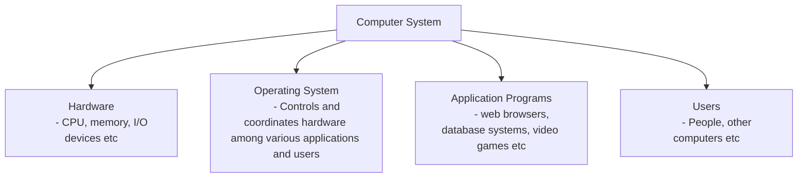

- There are 4 main parts


![[Pasted image 20250203223825.png | 300]]

- All the Hardware components connect through `a common bus` providing access to shared memory
- The devices compete for memory cycles

![[Pasted image 20250203230715.png|500]]

* I/O devices and CPU `can execute concurrently`
* Each device has a dedicated `Device controller` 
``` Device-Controller

> Device controllers have local buffers and an OS device driver to manage it
> So CPU move data from/to main memory to/from local buffers
> I/O operation happens from device to local buffer of its controller
```
* Device controller informs CPU that it has finished its operation by causing `an interrupt`
[[Interrupt]]


