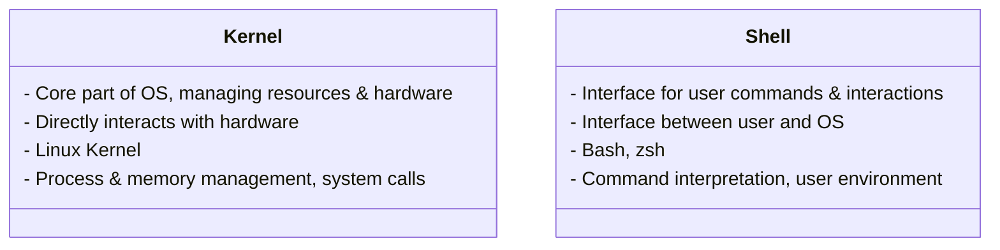

The kernel and the shell are two essential components of an operating system, each playing distinct roles. Here's how they differ:

### Kernel

- **Core Component**: The kernel is the core part of the operating system that directly interacts with the hardware.
    
- **Responsibilities**: It manages system resources, such as CPU, memory, and I/O devices. It handles process management, memory management, and system calls.
    
- **Types**: There are different types of kernels, including monolithic kernels, microkernels, and hybrid kernels.
    
- **Example**: In Linux, the kernel is often referred to as the "Linux kernel."
    

### Shell

- **Interface**: The shell is a command-line interface (CLI) or graphical user interface (GUI) that allows users to interact with the operating system.
    
- **Responsibilities**: It interprets and executes user commands, launches applications, and provides a user environment.
    
- **Types**: Common types of shells include Bourne Shell (sh), Bourne Again Shell (bash), Korn Shell (ksh), and Z Shell (zsh).
    
- **Example**: In a Linux system, the terminal (e.g., GNOME Terminal, KDE Konsole) provides the shell interface for user interaction.

